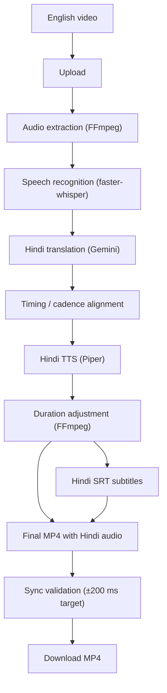

# TransCadence

**AI-powered Hindi video dubbing with synchronized subtitles.**

TransCadence converts an English lecture or video into a Hindi-dubbed MP4 with synchronized Hindi subtitles. A single backend pipeline combines automatic speech recognition, Gemini-based translation, Hindi text-to-speech, timing-aware audio adjustment, subtitle generation, and final video composition. A React frontend drives the workflow.

---

## Table of Contents

- [Features](#features)
- [Tech Stack](#tech-stack)
- [How It Works](#how-it-works)
- [Getting Started](#getting-started)
- [Usage](#usage)
- [API Reference](#api-reference)
- [Synchronization Approach](#synchronization-approach)
- [Project Structure](#project-structure)
- [Configuration](#configuration)
- [Docker](#docker)
- [Development Without Docker](#development-without-docker)
- [Testing](#testing)
- [Troubleshooting](#troubleshooting)
- [Security](#security)
- [Contributing](#contributing)
- [License](#license)

---

## Features

- English video to Hindi-dubbed video
- Hindi subtitles exported as SRT
- Word-level speech timing from ASR
- Pause-aware speech windows
- Hindi TTS with Piper
- Audio duration adjustment with FFmpeg
- Final MP4 generation
- Automated synchronization validation (±200 ms target)
- FastAPI backend, Dockerized
- React + Vite frontend with real job-status polling
- Gemini API key kept on the backend only
- Local project/history state via browser storage

> **Note:** The current MVP produces Hindi speech as the final spoken audio. It does not mix the original English narration underneath, which avoids English/Hindi voice overlap.

---

## Tech Stack

| Component | Technology |
|---|---|
| Frontend | React, TypeScript, Vite |
| Backend | FastAPI (Python 3.10) |
| Speech recognition | faster-whisper |
| Translation | Google Gemini |
| Hindi TTS | Piper |
| Audio/video processing | FFmpeg |
| Validation | Pydantic / FastAPI |
| Containerization | Docker, Docker Compose |
| Storage | Local filesystem |

---

## How It Works



---

## Getting Started

The backend runs in Docker Compose. The frontend runs locally with the Vite development server.

### Prerequisites

- Git
- Docker Desktop
- Node.js 20+ (recommended) and npm
- A Google Gemini API key

The backend container provides FFmpeg and the Python dependencies.

Verify your installation:

```bash
git --version
docker --version
docker compose version
node --version
npm --version
```

### 1. Clone the repository

```bash
git clone <repository-url>
cd TransCadence
```

### 2. Configure the Gemini API key

Create `backend/.env`:

```env
GOOGLE_API_KEY=YOUR_GEMINI_API_KEY
```

Do not commit this file. Make sure it is ignored:

```gitignore
backend/.env
```

### 3. Start the backend

From the project root:

```bash
docker compose up --build -d backend
docker compose ps
```

The backend is served at `http://127.0.0.1:8000`.

- Health check: `http://127.0.0.1:8000/health` should return `{"status": "ok"}`
- Interactive API docs (Swagger): `http://127.0.0.1:8000/docs`

### 4. Start the frontend

In a second terminal:

```bash
cd frontend
npm install
npm run dev
```

The frontend is normally served at `http://127.0.0.1:5173`.

### First-run checklist

- [ ] `backend/.env` created with `GOOGLE_API_KEY`
- [ ] Backend container running; `/health` responds
- [ ] Frontend dependencies installed and dev server running
- [ ] Short MP4 uploaded and pipeline completed
- [ ] Generated MP4 plays with Hindi audio
- [ ] Hindi subtitle timing checked

The first backend run may be slow because the local ML models (transcription and TTS) must be downloaded and cached.

---

## Usage

The main user journey:

1. Open the frontend and upload a video.
2. The backend creates a job and runs transcription.
3. The transcript is translated into Hindi.
4. The dubbing pipeline runs (timing, TTS, adjustment, subtitles, final MP4, validation).
5. The frontend polls job status and shows the actual processing state.
6. Download the finished MP4.

For best results, start with a short English clip with clear speech.

---

## API Reference

The frontend calls the same endpoints listed here. Full schemas are available in Swagger at `/docs`.

| Method | Endpoint | Description |
|---|---|---|
| `GET` | `/health` | Checks that the backend is running. |
| `POST` | `/api/upload` | Uploads a source video and creates a job. Accepts formats such as `.mp4` and `.webm`; video validation and duration limits apply. |
| `POST` | `/api/jobs/{job_id}/transcribe` | Runs faster-whisper. The transcript includes word-level timestamps used by the synchronization pipeline. |
| `POST` | `/api/jobs/{job_id}/translate` | Translates the transcript into Hindi with Gemini. Requests are batched to reduce API calls. |
| `POST` | `/api/jobs/{job_id}/process` | Runs the remaining pipeline: timing, speech windows, Hindi TTS, duration adjustment, audio composition, subtitles, final MP4, sync validation. |
| `GET` | `/api/jobs/{job_id}/status` | Returns the current state of a job. |
| `GET` | `/api/jobs/{job_id}/download` | Downloads the generated MP4. |

Typical request order:

```text
POST /api/upload
  → POST /api/jobs/{job_id}/transcribe
  → POST /api/jobs/{job_id}/translate
  → POST /api/jobs/{job_id}/process
  → GET  /api/jobs/{job_id}/status   (poll)
  → GET  /api/jobs/{job_id}/download
```

### Subtitle output

Subtitles are generated as SRT from the same timing data used for the dubbed audio:

```srt
1
00:00:00,500 --> 00:00:03,200
नमस्ते, आज हम इस विषय को समझेंगे।

2
00:00:03,500 --> 00:00:06,700
सबसे पहले इसके मूल सिद्धांतों को देखते हैं।
```

---

## Synchronization Approach

Replacing speech sentence by sentence is not enough for dubbing, because generated Hindi speech can be longer or shorter than the original. TransCadence uses a timing-aware pipeline:

1. **Word-level ASR timing.** The transcription stage preserves word timestamps.
2. **Speech-window detection.** Actual spoken regions are detected, and pauses between them are respected instead of treating each subtitle segment as a continuous block.
3. **Hindi TTS.** Each translated speech window is synthesized with Piper.
4. **Duration adjustment.** FFmpeg `atempo` processing fits each generated clip to its target window.
5. **Timeline composition.** Adjusted clips are placed at their target positions on the final audio timeline.
6. **Validation.** After the final video is generated, the backend checks synchronization against a tolerance of **±200 ms**, which helps catch timing regressions before a file is offered for download.

---

## Project Structure

```text
TransCadence/
├── backend/
│   ├── app/
│   │   ├── main.py
│   │   └── ...
│   ├── tests/
│   ├── requirements.txt
│   ├── Dockerfile
│   ├── README.md
│   └── .env                 # local only, not committed
├── frontend/
│   ├── public/assets/bg.png
│   ├── src/
│   │   ├── App.tsx
│   │   ├── api.ts
│   │   ├── jobs.ts
│   │   ├── design.css
│   │   └── main.tsx
│   ├── package.json
│   └── vite.config.ts
├── storage/                 # generated files and job data
├── docker-compose.yml
├── .dockerignore
└── README.md
```

---

## Configuration

### Backend (`backend/.env`)

| Variable | Description |
|---|---|
| `GOOGLE_API_KEY` | Gemini API key used for translation. Required. |

### Frontend

| Variable | Example | Description |
|---|---|---|
| `VITE_API_BASE_URL` | `http://127.0.0.1:8000` | Single base URL for all backend requests. |

Frontend environment variables are not secret storage. Never put private credentials in `VITE_*` variables.

### CORS

The backend allows the local frontend development origins (`http://127.0.0.1:5173` for the frontend, `http://127.0.0.1:8000` for the backend). For deployment, replace these with your production frontend origin.

### Storage

With Docker Compose, generated jobs and media are mounted so they persist across container restarts:

```text
./storage:/app/storage
```

Model files are cached in a Docker volume, so they are not re-downloaded on every restart.

---

## Docker

The current Compose setup defines a backend-only service. The frontend stays outside the container for simple local development and fast UI iteration.

```text
Browser
  ├── React/Vite (localhost:5173)
  │        │ HTTP API
  │        ▼
  └── Docker: TransCadence Backend
        ├── FastAPI
        ├── faster-whisper
        ├── Piper
        ├── FFmpeg
        ├── Gemini API client
        ├── ./storage
        └── model cache
```

Common commands:

```bash
docker compose up -d backend              # start
docker compose up --build -d backend      # rebuild and start
docker compose logs -f backend            # follow logs
docker compose ps                         # check containers
docker compose restart backend            # restart
docker compose down                       # stop
```

---

## Development Without Docker

Docker is the recommended backend runtime. For direct Python development, activate the project's virtual environment and run:

```bash
python -m uvicorn backend.app.main:app --reload --host 127.0.0.1 --port 8000
```

Then start the frontend as usual (`cd frontend && npm run dev`).

Do not run a local Uvicorn process on port 8000 while the Docker backend is running.

---

## Testing

From the backend Python environment:

```bash
pytest -q
```

The test suite covers the core services: transcription, translation, TTS, audio duration adjustment, audio composition, SRT generation, video generation, synchronization validation, and API integration.

---

## Troubleshooting

**Backend container is not running**

```bash
docker compose ps
docker compose logs --tail=200 backend
```

**Frontend cannot connect to the backend**

Confirm `http://127.0.0.1:8000/health` responds, that `VITE_API_BASE_URL` points to `http://127.0.0.1:8000`, and that the Vite dev server is running on its expected port.

**Gemini translation fails**

Check that `backend/.env` contains a valid `GOOGLE_API_KEY`. Requests are also subject to the quota and limits of the Google Cloud project associated with the key. Never paste API keys into source code, commits, screenshots, or the browser.

**First run is slow**

Local ML models are downloaded and cached on first use. Later runs are normally faster.

**Port 8000 is already in use**

```bash
docker compose ps
netstat -ano | findstr :8000     # Windows
lsof -i :8000                    # macOS / Linux
```

Stop the conflicting service before starting the backend.

---

## Security

The browser is treated as an untrusted client.

- Gemini credentials stay on the backend; frontend code contains no provider secret.
- `.env` is not copied into the Docker image.
- Input validation is enforced server-side.
- Uploaded and generated files are kept in job-specific storage.
- The backend container runs as a non-root user.
- Only the backend API port is exposed by the current Compose setup.
- FFmpeg processing runs on the server.

For production deployment, consider additional hardening: upload limits, resource quotas, isolation, cleanup, rate limiting, and external storage.

---

## Contributing

```bash
git checkout -b feat/your-feature
# make changes and test them
git add .
git commit -m "feat: describe your change"
git push -u origin feat/your-feature
```

Please keep the following out of Git: API keys, generated media, frontend build output, and dependency caches.

---

## License

No license has been specified yet. Add the project's intended open-source license before public release.

---

**TransCadence: turning spoken English lectures into synchronized Hindi learning content.**